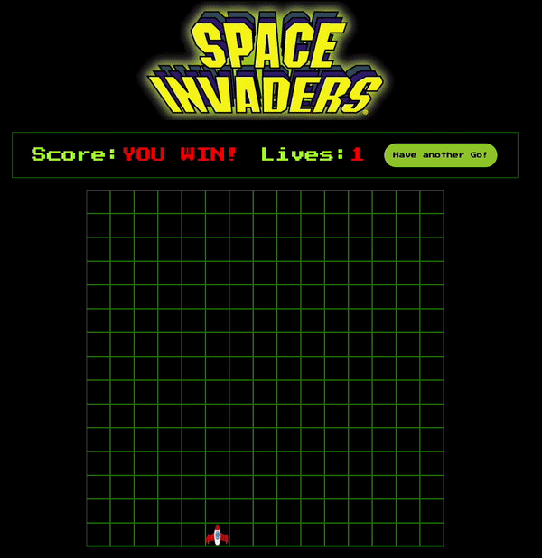

# GA SEI Project 1 : SPACE INVADERS
---
## Overview
SPACE INVADERS was my first (solo) project completed on General Assembly's Software Engineering Immersive, and was my first attempt at using JavaScript.
The timeframe for completing the project was 7 days.

### HOW TO PLAY
For the uninitiated, SPACE INVADERS is a classic 80s arcade game requiring the player (spaceship) to shoot down the invading aliens to score points before they reach the bottom of the screen.

Please enjoy on GitHub Pages [here.](https://pages.git.generalassemb.ly/tatianaguzun/ga-project-1/)

Controls
Press the START button.
Move the spaceship LEFT (<-) and RIGHT (->) using the arrow keys.
Hit SPACEBAR to shoot.

---

  

---
### Technologies Used
* HTML
* CSS
* Vanilla JavaScript ES6
* Git/GitHub
* Google Fonts

### MVP

In order to ensure I had a working product by the deadline, I decided to have my MVP ready by the end of day 3. This would be the bare bones of the game:

* A container with grids for game components
* Moving and shooting player spaceship
* Aliens that explode on impact with laser & move toward the bottom of the screen
* Points board
* Lives board
* Gameover and Win conditions
* Styling
* Sounds effects

### Key Learnings
* JavaScript fundamentals. This was my first JavaScript project and no frameworks were used so it really solidified the JS concepts, methods, and DOM manipulation I’d learnt so far.
* I got a grasp on Git and GitHUB 

### Challenges
The most challenging part in this project was executing the logic of the alien movement and ensuring all timed intervals were stopped or cleared as they created a lot of issues with the game restart. This project was a huge learning curve and I really enjoyed the challange and putting all the things we've learnt so far into practice.

It is really satisfying to have a a functional game made purely with vanilla JavaScript. Solving each bug as I went along, after encountering recurring bugs throughout the process was a huge success.

### Future Improvements
* To add a colission for the bombs meeting the aliens laser
* Levels
* Different types of aliens with different points
* Adding responsive design.

